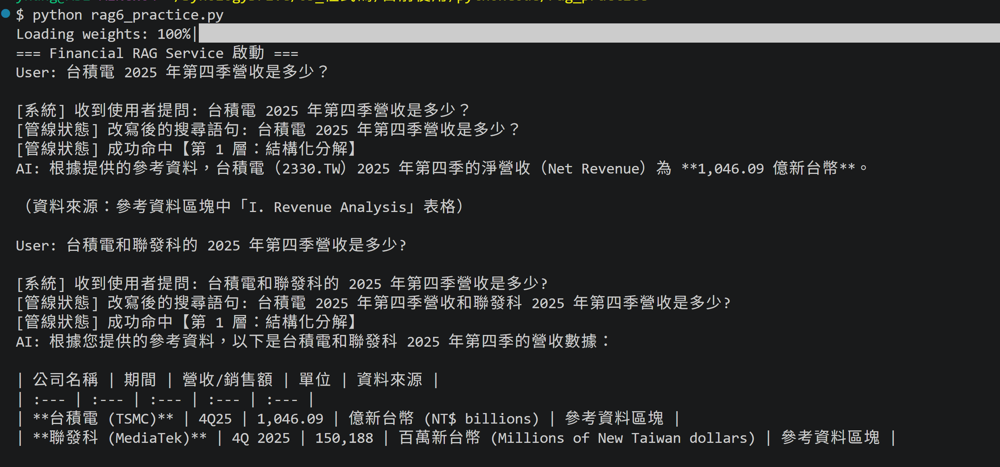

# 台美股公司季報 RAG 產品雛形

## 用途

個人經驗與能力展示    

## 特點

財報數據擷取，不含質化分析

### ✅ RAG 概念已實作 
1. 萃取文件裡的表格, fixed size chunk + slide-window + OCR
2. Rewrite query, 支援多輪對話並且轉成結構化內容(JSON格式)
3. 股票代號名稱正規化。會轉換公司俗稱、綽號成股票代號。
4. 資料相關性和來源, Metadata filtering
5. Idempotent Upsert, 做在向量資料庫索引 Market-stockTicker-year-quarter-idx
6. 知識庫和對話歷史的資料隔離，使用向量資料庫 ChromaDB 和記憶體
7. 對話介面 GUI

### 程式碼特點:    
1. 策略模式(strategy pattern) 應用在文件解析器，若以後有更強的工具，或改變策略時，可以抽換。先用套件 [anydoc](https://github.com/firecrawl/anydoc) 解析，若解析失敗則改用有 OCR 機制的 [docling](https://github.com/docling-project/docling)。
2. 轉接器模式(Adapter pattern)應用在向量庫索引和股票代號名稱正規化。如果向量庫索引名稱和股票代號不同，會增減市場和別名自動轉換查詢。
3. 優雅降級
  - 將問題轉成 JSON 結構化內容，並解決指代(Coherence) 情境，若無法解決，則降為基於規則的實體名稱與向量搜尋，例如回應內容有 Markdown 或不符 JSON 格式的內容

##### 主要檔案
1. myrag_module.py
2. financial_ingestion_advanced.py
3. entity_normalizer.py
4. rag6_practice.py
5. test_financial_rag.py

### 不含:   
1. Agentic RAG
2. HyDE (Hypothetical Document Embeddings)
3. 判斷問題是量化或質化分析的 Router
4. Hybrid search(BM25, Re-ranking)
5. llamaIndex, LangChain

## 系統需求
可在地端正常運作，已驗過在 NVIDIA 4080 顯卡 + 2B / 4B 大語言模型正常運作。不須顯卡也能執行，速度會較慢。

## FAQ
1. 表格文件情境仰賴套件 Anydoc 解析，它會保留情境。
2. 掃描的表格文件，改用套件 Docling 。
3. 目前僅有台積電和聯發科的 25Q4 季報。

## 已知問題
1. 每位使用者的訊息沒有完全隔離。暫時不處理。

## 軟體授權

AGPL-v3

## 套件
1. anydoc
2. Docling   
@techreport{Docling,
  author = {Deep Search Team},
  month = {8},
  title = {Docling Technical Report},
  url = {https://arxiv.org/abs/2408.09869},
  eprint = {2408.09869},
  doi = {10.48550/arXiv.2408.09869},
  version = {1.0.0},
  year = {2024}
}

# Financial RAG prototype for TW and US financial reports
